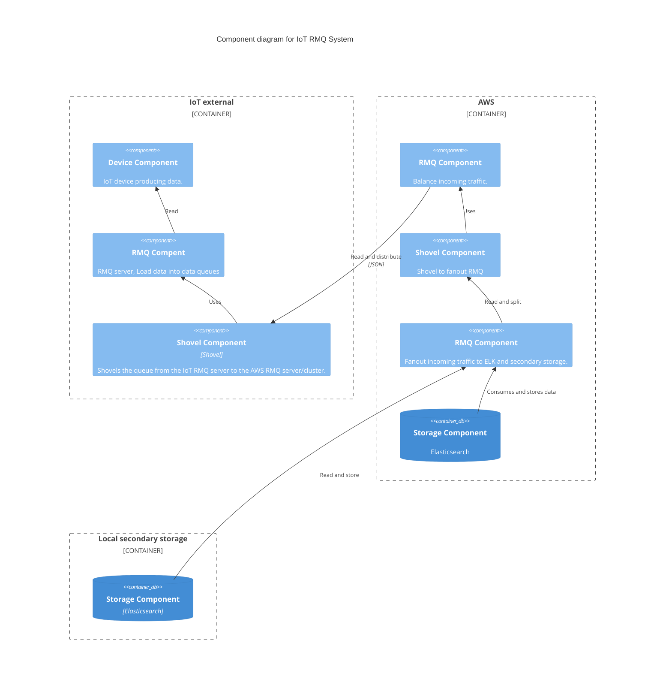
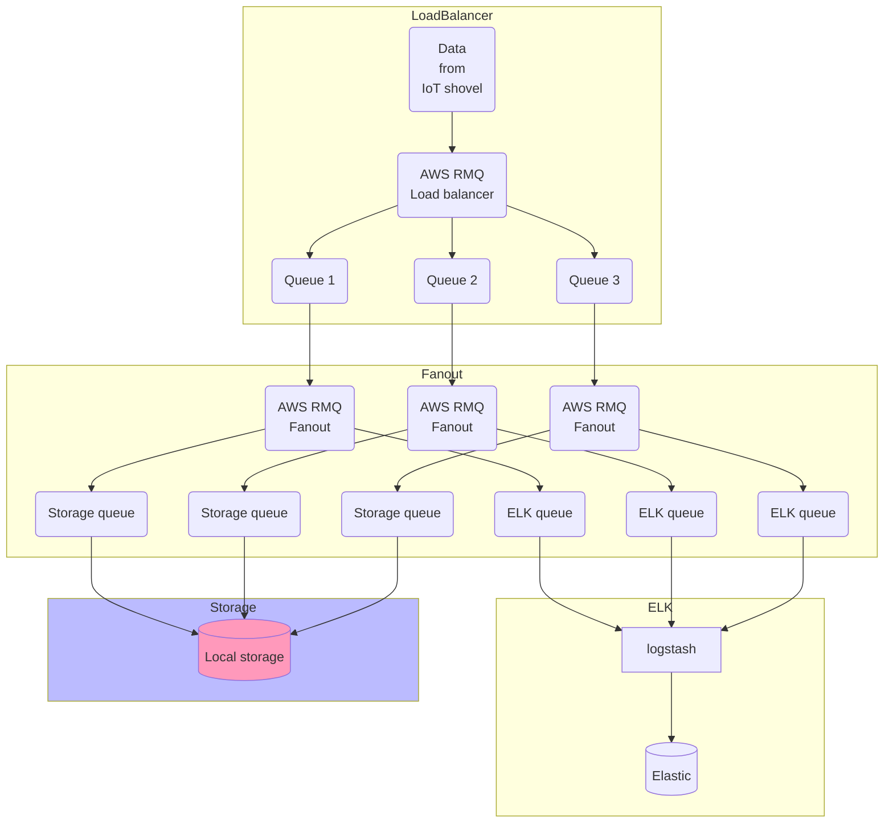

# Motivation

This is a difficult question to answer without additional information. The question does not specify any Service Level Objectives or Indicators.

Initial questions that come to mind are described below.

## Error budget

How much error budget is allowed? Put differently what percentage of downtime is allowed that can be used for testing, roll-outs, ...

## Geographical distribution of IoT devices

Are the IoT devices concentrated in a single location or are we talking about a global distribution? The answer to this question has an impact on choosing a cluster location for AWS, logstash and Elasticsearch.

If the distribution is global, how to deal with a local outage? Do other clusters take over? How to deal with the extra load if one chooses this option?

## Time distribution of IoT data

Does the incoming data volume/requests changes over a time period (e.g. more data during rush hours, but less during the night for example)? In other words, can we work with average data volumes or do we need to consider certain peak distributions.

## Redundency/ Reliability - Failure rates of the used technology

How much redundancy do we want to build in (99.9% or 99.9999% availability)? What are the failure rates for the choosen technology? How does that rate evolves over time?

The redundacy of course is not only on the availability of the processing servers but also on the storage devices. Elasticsearch data can be "easily" scaled horizontally but what about the desired extra storage for the data scientists, what are the desired storage and availability requirements?

## Network load

How many IoT devices are currently online and what are future expectations. How much bandwith do they need? What is a worst case scenario (peak bandwidth)? How many requests should the secondary storage be able to handle. Does data needs to be transferred from storage units to process units, or is processing running where the data resides? 


Depending on the requirements one should decide on which technology one wants to use for the storage. Access speeds, redundancy, expected lifetime, lifecycle management...

## Security

How sensitive is the data? Are there any legal restrictions (data privacy) that apply on the datasets, is it even allowed to generate and store them in a secondary storage unit for data analysis purposes. Who can have access to this data?

# Description

As RMQ newbie my strategy would be to use exchanges in fanout mode. According to the documentation this allows to bind several queues to a datastream such that data can be routed to different receivers/consumers.

Depending on the redundancy, network load, etc... requirements the amount of bound queues can be increased in the cluster. What was not clear to me was how to scale exchanges, or what are the limitations of such a fanout exchange (max amount of bound queues, data throughput,... ).

As a simple example case, where we have bound two queues to a fanout exchange, one queue would be consumed by logstash while the other one pushes the data to the alternative storage unit by means of the callback function. Depending on the preferences of the data scientist different storage formats could be chosen: MongoDb, H5, feather, parquet, ....  

In any case, from the hardware side, I would consider using encrypted Logical Volumes (linux LVM) with mirroring for redundancy and throughput optimization, unless a nosql storage method is chosen that easily can be scaled horizontally (add more nodes, increase replicas, configure for performance optimization).

Again depending on the loads one could imagine using shovel to transfer the secondary stream or streams to another RMQ instance to load balance the storage of data to the secondary storage unit.


# Solution

## Context Diagram

 ```mermaid
C4Context
      title System Context diagram for RabbitMQ System

      Person_Ext(customerA, "ELK customer", "Get data from ELK")   
      
      Enterprise_Boundary(b0, "Mobility House") {
        Enterprise_Boundary(b01, "IoT external"){
            System_Ext(iot, "RMQ Server", "IoT devices as publishers")
        }
        Enterprise_Boundary(b02, "AWS RMQ external"){
            System_Ext(aws1, "AWS RMQ", "RMQ cluster on AWS")
        }
        Enterprise_Boundary(b03, "AWS ELK external"){
            System_Ext(aws2, "AWS ELK", "Elasticsearch and logstash")
        }
        Enterprise_Boundary(b04, "Internal storage"){
            System(storage2, "Secondary Storage", "Provide data for data science.")
        }

        Person(datascientist, "Data Scientist", "Analyse data")      
       
      }
      
      Rel(iot, aws1, "Sends data to queue", "Queue")
      Rel(aws1, aws2, "Sends data to ELK", "Logstash")

      BiRel(customerA, aws2, "Uses")
      BiRel(datascientist, aws2, "Uses")
      BiRel(datascientist, storage2, "Uses")
      BiRel(customerA, datascientist, "Communicate")

      UpdateRelStyle(iot, aws1, $textColor="blue", $lineColor="blue", $offsetX="-50",$offsetY="-30")
      UpdateRelStyle(aws1, aws2, $textColor="blue", $lineColor="blue", $offsetY="-40", $offsetX="-50")

      UpdateRelStyle(customerA, aws2, $textColor="green", $lineColor="green", $offsetY="-40", $offsetX="-50")
      
      UpdateLayoutConfig($c4ShapeInRow="3", $c4BoundaryInRow="2")
 ```

## Component diagram




# Details on AWS configuration

